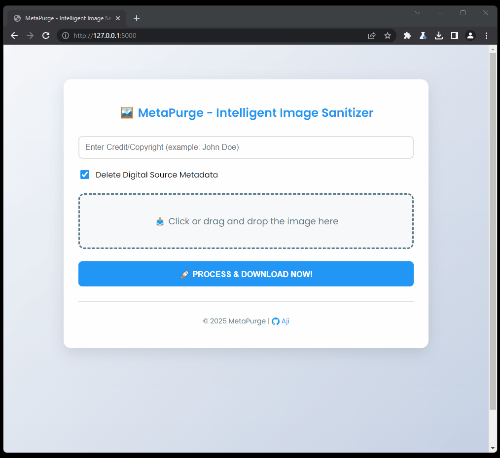

# 🔒 MetaPurge - Intelligent Image Sanitizer (v2.0)

[](https://python.org)
[](https://opensource.org/licenses/MIT)
[](https://flask.palletsprojects.com)

Professional batch image metadata cleaner with AI-generated content detection and digital fingerprint cleaning. Now with bulk processing capabilities!



## 🌟 Major New Features
- 🚀 **Batch Processing** - Handle up to 20 images simultaneously
- 📦 **ZIP Archive Output** - Download all processed images in single ZIP file
- 🎯 **Real-time Previews** - Interactive grid preview with file management
- 🛠️ **Smart Status Tracking** - Real-time processing status per file
- 🧹 **One-Click Cleanup** - Remove all files with single button
- 📶 **Progress Visualization** - Live progress bar and counter

## ⚙️ Installation
```bash
# Clone repository
git clone https://github.com/wwwroot/metapurge.git
cd metapurge

# Create virtual environment
python -m venv venv
source venv/bin/activate  # Linux/Mac
venv\Scripts\activate     # Windows

# Install dependencies
pip install -r requirements.txt

# Run application
python app.py
```
Visit `http://localhost:5000` in your browser

## 🖱️ Usage Workflow
1. **Upload Files** (Multiple Methods):
   - Drag & drop images to the zone
   - Click to select files (Ctrl/Cmd + click for multiple)
   - Mix both methods (max 20 files)

2. **Edit Metadata**:
   - Add credit/copyright (JPEG only)
   - Toggle digital source metadata removal

3. **Preview & Manage**:
   - Hover for image preview
   - Click × to remove individual files
   - Use "Remove All" for full reset

4. **Process & Download**:
   - Click "Process All" to start sanitization
   - Monitor progress via status indicators
   - Auto-download ZIP archive when complete

## 🧠 Enhanced Tech Stack
- **Core**: Python 3.8+ • Flask 2.0+
- **Image Processing**: Pillow • Piexif • Rembg
- **Batch Operations**: In-memory ZIP compression
- **Frontend**: 
  - Drag & Drop API • FileReader API
  - CSS Grid • Dynamic preview rendering
  - ProgressBar API • Real-time status updates

## 🚨 Important Notes
- **File Limits**: 
  - Max 20 files per batch
  - Max 50MB total size
  - Supported formats: JPG/JPEG, PNG, WEBP, GIF, BMP

- **Metadata Handling**:
  - Credit metadata only for JPG/JPEG
  - Automatic metadata stripping for other formats
  - EXIF: Preserves DateTimeOriginal

## 🤝 Contributing Guide
1. Fork repository
2. Create feature branch:
   ```bash
   git checkout -b feature/AmazingFeature
   ```
3. Test changes thoroughly:
   - Image format compatibility
   - Batch edge cases
   - Error handling scenarios
4. Submit Pull Request

## 📜 License
Distributed under the MIT License. See `LICENSE` for more information.
